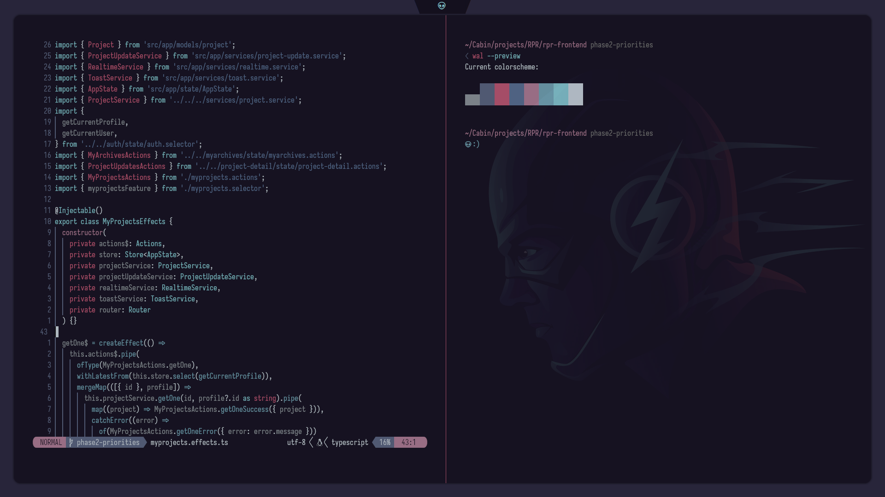
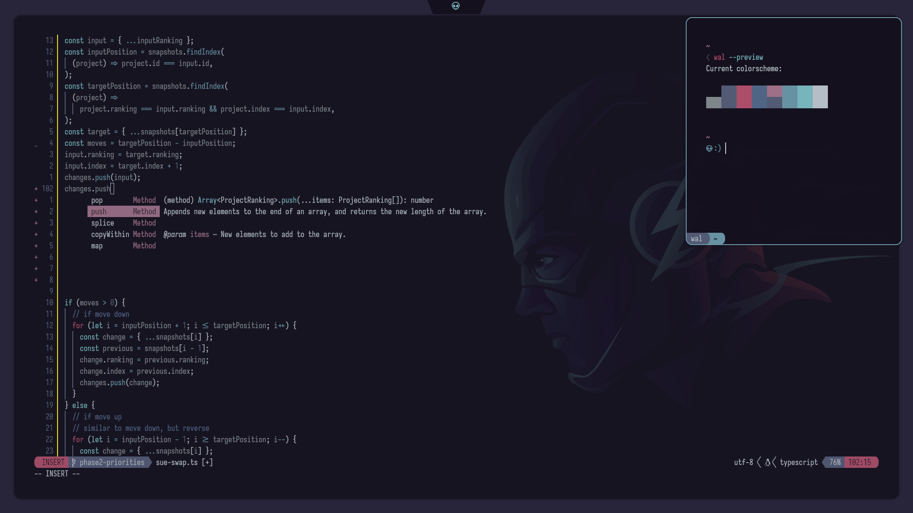
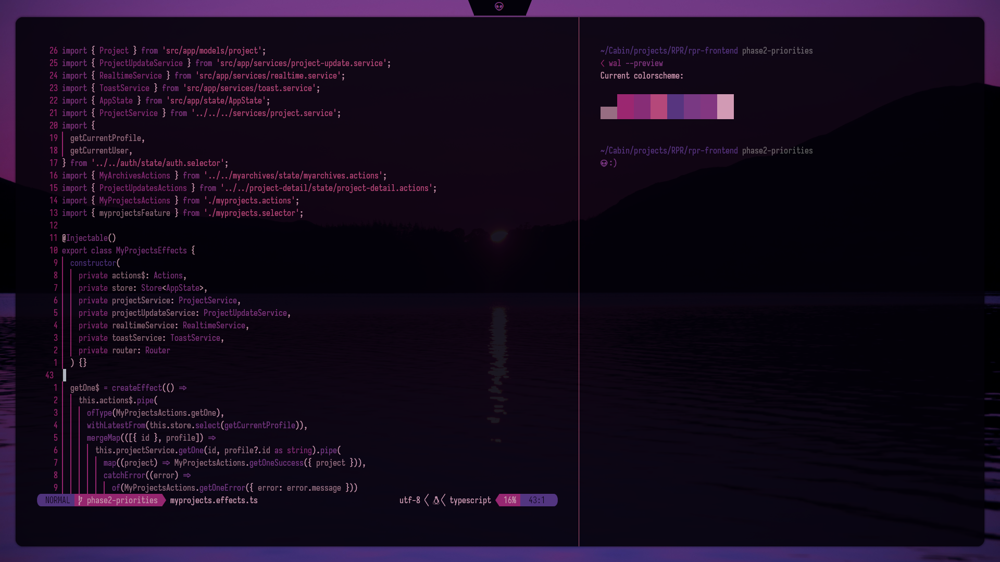
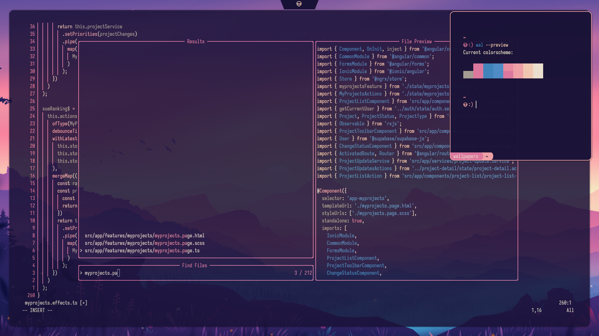

# Pywal.nvim Enhanced

This project is a fork of the original [pywal.nvim](https://github.com/AlphaTechnolog/pywal.nvim) repository, which is now archived. It includes several enhancements in color mappings and integration with other plugins.

Pywal.nvim is a complete reimplementation of [pywal.vim](https://github.com/dylanaraps/wal.vim) in Lua and is designed to work seamlessly with Neovim. It comes with built-in support for several Neovim Lua plugins.

## Features

- A complete rewrite of the original pywal.vim in Lua.
- Seamless integration with Neovim.
- Built-in support for various Neovim Lua plugins.

## Enhancements

- [x] Enhance Treesitter Syntax Highlights
- [ ] Automatic colorscheme updating when using the `pywal` command.

## Screenshots






## External Plugin Support

- Telescope
- Nvim Tree
- Tresitter
- Lsp
- Lsp saga
- Coc
- Bufferline
- Illuminate
- Diff
- Git signs
- Git gutter
- Lualine
- Feline
- Ident-BlankLine

## Installation

You can install this plugin with packer:

```lua
use { 'erdivartanovich/pywal.nvim', as = 'pywal' }
```

Or with vim-plug:

```vim
Plug 'erdivartanovich/pywal.nvim', { 'as': 'pywal' }
```

## Active theme

To active the theme call this in your neovim config:

```lua
local pywal = require('pywal')

pywal.setup()
```

Or with vim script:

```vim
colorscheme pywal
```

> It will set automatically the `vim.opt.termguicolors` to true

## Activating lualine theme

Place this in your lualine config:

```lua
local lualine = require('lualine')

lualine.setup {
  options = {
    theme = 'pywal-nvim',
  },
}
```

Or you can override lualine config and theme with your own configurations:

```lua
      local lualine = require('lualine')
      local pywal_core = require('pywal.core')
      local colors = pywal_core.get_colors()
      local custom_theme = {
        normal = {
          a = { bg = colors.color4, fg = colors.background }, -- asign color from pywal colors
          b = { bg = colors.color1, fg = colors.foreground },
          c = { bg = '#2b2637', fg = colors.foreground },     -- or you can asign static color
        },

        insert = {
          a = { bg = colors.color4, fg = colors.background }
        },

        command = {
          a = { bg = colors.color5, fg = colors.background },
          b = { bg = colors.background, fg = colors.color5 },
        },

        visual = {
          a = { bg = colors.color6, fg = colors.background },
          b = { bg = colors.background, fg = colors.color6 },
        },

        replace = {
          a = { bg = colors.color11, fg = colors.background },
          b = { bg = colors.background, fg = colors.color11 },
        },

        inactive = {
          a = { bg = colors.background, fg = colors.foreground },
          b = { bg = colors.background, fg = colors.foreground, gui = "bold" },
          c = { bg = colors.background, fg = colors.foreground },
        },
      }

      lualine.setup({
        options = {
          theme = custom_theme,
          section_separators = { left = '', right = '' },
        },
        sections = {
          lualine_a = {
            { 'mode', separator = { left = '' }, right_padding = 2 },
          },
          lualine_b = { 'branch' },
          lualine_c = { 'filename' },
          lualine_x = { 'encoding', 'fileformat', 'filetype' },
          lualine_y = { 'progress' },
          lualine_z = {
            { 'location', separator = { right = '' }, left_padding = 2 },
          },
        },
        inactive_sections = {
          lualine_a = {},
          lualine_b = {},
          lualine_c = { 'filename' },
          lualine_x = { 'location' },
          lualine_y = {},
          lualine_z = {},
        },
        tabline = {},
        extensions = {},
      })
```

## Activating the feline theme

You can put this to your config to activate the feline config:

```lua
local present, feline = pcall(require, 'feline')

if not present then
  return
end

local present, pywal_feline = pcall(require, 'pywal.feline')

if not present then
  return
end

feline.setup({
  components = pywal_feline,
})
```

Then you will see the feline bar working successfully

## Using the core to get the colors

If you want to get the colors into a lua dictionary

```lua
local pywal_core = require('pywal.core')
local colors = pywal_core.get_colors()
```

## How it works

Pywal automatically generate a file called `colors-wal.vim` in `~/.cache/wal/colors-wal.vim`,
it file contains all the colors that are necesary to works for vim, it files looks
like this:

```vim
" Special
let wallpaper  = "/home/user/Pictures/winter-purple.jpg"
let background = "#110914"
let foreground = "#e3cfe2"
let cursor     = "#e3cfe2"

" Colors
let color0  = "#110914"
let color1  = "#A378B6"
let color2  = "#B687AD"
let color3  = "#D9A2AF"
let color4  = "#F8DDAD"
let color5  = "#AD90CF"
let color6  = "#D2ACD6"
let color7  = "#e3cfe2"
let color8  = "#9e909e"
let color9  = "#A378B6"
let color10 = "#B687AD"
let color11 = "#D9A2AF"
let color12 = "#F8DDAD"
let color13 = "#AD90CF"
let color14 = "#D2ACD6"
let color15 = "#e3cfe2"
```

The theme only reads it files variables and then create a colors dictionary to create
a theme based in it's colors

## Enjoy

If you like this and my work you can give me a star :)
